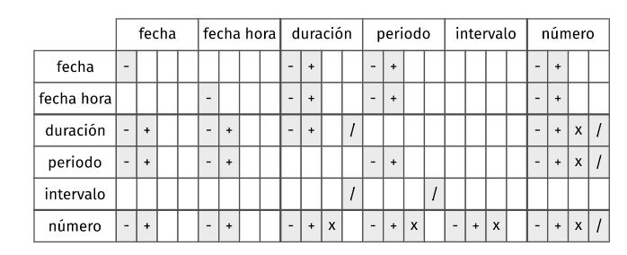

```{r setup, include=FALSE}
library(tidyverse)
library(datos)
library(lubridate)
library(hms)
```

**Tener en cuenta que lubridate no se carga con library(tidyverse)**   
Un dato **date-time** es un punto en el tiempo, almacenado como el nro de segundos desde el 01-01-1970 00:00:00 UTC. 


```{r as_datetime}
dt <- as_datetime(1511870400)
## "2017-11-28 12:00:00 UTC"
unclass(dt)
dt
typeof(dt)
is.numeric(dt)
mode(dt)
```
Ver el siguiente [libro](https://bookdown.org/hneth/ds4psy/10-2-time-essentials.html): 

Un dato tipo **date** es una fecha almacenada como integer: el nro. de días desde el 01-01-1970.
```{r as_date}
d <- as_date(17498)
## "2017-11-28"
```
Un dato tipo **time** es una hora almacenada como el nro. de segundos desde 00:00:00  
```{r as.hms}
t <- hms::as_hms(85)
t
```
**las clases  date_time** implementadas en R: 

1. `Date` representa la fecha en dias sin considerar horas
1. `POSIXct` es la principal clase date-time para representar tiempo calendario.
1. `POSIXlt` es una clase date-time adicional para representar local time (como listas).


```{r Dates}
Sys.Date()
date() # R base (da warning xq no tiene x... pero así escrito trae la fecha actual)
lubridate::today()
as.Date(0, origin = "1970-01-01")
#Sys.getlocale(category = "LC_ALL")
```
¿Que pasa con las fechas anteriores a 01-01-1970? las considera en negativo.
```{r Titanic}
dt_Titanic <- as.Date("1912-04-15")
unclass(dt_Titanic)
```

REVISAR: La clase **POSIXct** almacena internamente esta cifra como un número entero, mientras que la clase **POSIXlt** la descompone en una lista con elementos para los segundos, minutos, horas, día, mes y año.

## Formatos
Es importante cómo R puede interpretar la fecha que ingresamos:

```{r formato}
format(dt_Titanic, "The date %F denotes a %A in %B, in the %V. week of the year %Y.")

as.Date("01-2-3") # no entiende 2001... entiende 0001
as.Date("01/2/3")
```
La mejor forma de entrar fechas es con formato 4 dígito para año, 2 dígito para mes y 2 dígitos para día. Es el formato por default que utiliza R y la especificación de conversión sería: `"%Y-%m-%d"`

%Y año de 4 posiciones
%y año de 2 posiciones
%m mes de 2 posiciones
%d dia de 2 posiciones

* Siempre conviene entrar la fecha con año de 4 posiciones.  
* Usar un orden razonable de las unidades para especificar la fecha (idealmente decreciente `"%Y-%m-%d"`).  
1. (EU convention)   magnitud creciente `"%d-%m-%Y"`  
1. (ISO standard, R) magnitud creciente `"%Y-%m-%d"`  

Para nombrar los días de la semana y los meses se utiliza la función `format` con los siguientes argumentos:  

%a: Abbreviated weekday name (**in the current system locale**). Options are: Mon, Tue, Wed, Thu, Fri, Sat, Sun  

%A: Full weekday name (…):  
Monday, Tuesday, Wednesday, Thursday, Friday, Saturday, Sunday  

%b: Abbreviated month name (…):  
Jan, Feb, Mar, Apr, May, Jun, Jul, Aug, Sep, Oct, Nov, Dec  

%B: Full month name (…):  
January, February, March, April, May, June, July, August, September, October, November, December  
Otras: Ver `?strptime  # for a list of possible format symbols` 

%C: Century ast two-digit decimal number (00–99): the integer part of the year divided by 100: 20

%e: Day of the month as an integer (1–31), with a prefix space for a single-digit number: 19

%h: Equivalent to %b: Jul

%H: Hours as two-digit decimal number (00–23): 15

%I: Hours as two-digit decimal number (01–12): 03

%j: Day of year as three-digit decimal number (001–366): 200

%M: Minute as two-digit decimal number (00–59): 04

%p: AM/PM indicator in the locale. Used in conjunction with %I and not with %H: PM

%S: Second as two-digit integer (00–61), allowing for up to two leap-seconds: 12

%u: Weekday as single-digit decimal number (1–7, Monday is 1): 1

%U: Week of the year as two-digit decimal number (00–53) using Sunday as the first day 1 of the week (US convention): 29

%V: Week of the year as two-digit decimal number (01–53) as defined in ISO 8601: 29

%w: Weekday as single-digit decimal number (0–6, Sunday is 0): 1

%W: Week of the year as two-digit decimal number (00–53), using Monday as the first day of week (UK convention): 29

For details on additional specifications, evaluate `?strftime()` on your system.

```{r format explicate_date}
explicate_date <- "La fecha '%y-%m-%d' es un día %A en %B de %Y."

format("Sys.Date()", format = explicate_date)
```
También se pueden leer strings que contienen fechas:  
```{r transformar_segun_formatos_fecha}
parse_date("29 abril 2020", format = "%d %B %Y", locale = locale("es"))
parse_date("29 Abril 2020", format = "%d %B %Y", locale = locale("es"))
parse_date("April 29, 2020", format = "%B %d, %Y")

local_time(dt, tz = NULL, units = "secs")
local_time(dt, tz = "America/Buenos_Aires")

as.Date("Mar., 20/06/30", format = "%a, %y/%m/%d", locale = locale("es")) #ojo que en español la abreviatura lleva punto
as.Date("Julio 1, 2020", format = "%B %d, %Y")
as.Date("el 2do dia de Julio (en 2020)", format = "el %ddo dia de %B (en %Y)")

#Importante ver con la funcion locale()
```


## Transformar Date-Times

Convierte cadena de caracteres o numeros a formato Date-time:  
1. Identifica el orden del año, mes, día, hora, minuto y segundo en tus datos. 
1. Usa las siguientes funciones cuyo nombre replica el orden de tus datos


```{r ymd_hms}
ymd_hms("2017-11-28T14:02:00") #también se puede usar ymd_hm(), ymd_h()
# se puede usar la T o dejar en blanco
```
```{r ydm_hms}
ydm_hms("2017-22-12 10:00:00") #también se puede usar  ydm_hm(), ydm_h()
```

```{r mdy_hms}
mdy_hms("11/28/2017 1:02:03") #también se puede usar mdy_hm(), mdy_h(). 
```
```{r dmy_hms}
dmy_hms("1 Jan 2017 23:59:59") #también se puede usar dmy_hm(), dmy_h(). 
```

```{r ymd()}
ymd(20170131) #también se puede usar ydm(). 
```

```{r mdy}
mdy("Julio 4th, 2000") # también se puede usar myd(). 
```

```{r dmy}
dmy("4th de Julio '99") # también se puede usar dym(). 
```

```{r yq}
yq("2001: Q3")  #Q para el trimestre.
```

```{r hms}
hms::hms(sec = 0, min = 1, hours = 2)
#También lubridate::hms(), hm() y ms(), que devuelven periodos.

```
## Parsear y recuperar times: 

```{r ahora y formatos}
# parse times:
(tm1 <- as.POSIXct("10:30:45", format = "%H:%M:%S"))
#> [1] "2021-04-10 10:30:45 CEST"
(tm2 <- as.POSIXct("16:45", format = "%H:%M"))
#> [1] "2021-04-10 16:45:00 CEST"
(tm3 <- as.POSIXct("2.30 am", format = "%I.%M %p"))
#> [1] "2021-04-10 02:30:00 CEST"
(tm4 <- as.POSIXct("5 pm", format = "%I %p"))
#> [1] "2021-04-10 17:00:00 CEST"

ahora <- now()
explicate_time <- "%a, %Y-%m-%d %H:%M:%S %Z (%z from UTC)"
format(ahora, format = explicate_time)

```


## Extrae o define algún componente de fecha
* Usa una función para conseguir un componente.   
* Asigna a una función para cambiar un componente.   

```{r day}
d
day(d) 
day(d) <- 1
d
```

```{r date}
date(dt) # Componente fecha. 
```
```{r year}
year(dt)   #Año. 
```

```{r isoyear_epiyear}
isoyear(dt) #El año ISO 8601
epiyear(dt) #Año epidemiológico
```

```{r month}
month(dt) #month(x, label = FALSE, abbr = TRUE, locale = Sys.getlocale("LC_TIME"))
```


```{r wday}
wday(dt) # dìa de la semana
#wday(x, label = FALSE, abbr = TRUE, week_start = getOption("lubridate.week.start", 7),  locale = Sys.getlocale("LC_TIME"))
```
```{r otras_partes_fechas}
qday(dt) #Día del trimestre.
hour(dt) #Hora. 
minute(dt) #Minutos. 
second(dt) #Segundos.
week(dt) #Semana del año. 
isoweek(dt) #Semana ISO 8601.
epiweek(dt) #Semana epidemiológica.                                
quarter(dt) #Trimestre. 
semester(dt) #Semestre. 
am(dt) #¿Es am? am(dt) 
pm(dt) #¿Es pm? pm(dt)
dst(dt) #¿Es horario de verano? dst(d)
leap_year(dt) #¿Es año bisiesto?
```


```{r update_date}
update(dt, mday = 2, hour = 1) 
```

## Funciones muy ùtiles en programación
```{r now}
now() #now(tzone = “") Hora actual en tz  devuelve fecha-hora con indicaciòn del tiempo +/- a UTC
```


```{r today}
today()   # today(tzone = "") Fecha actual en un tz  
```

## Operaciones con Date/Date-Time
```{r}
next_week <- Sys.Date() + 0:6 #calcula los 7 días de la semana
every_2_weeks  <- seq(dt, length = 10, by = "2 weeks")
nueva_fecha <- ymd(20210731)
every_month <- seq(nueva_fecha, length =  12, by = "months") # ver que los meses de 30 o 28 días, no los deja "mal", pero los lleva a días del mes siguiente lo maneja como periods
every_2_weeks
every_month
```


 
## Redondea Date-time 

floor redondea hacia abajo segun la unidad seleccionada:
si selecciona month va a dejar el más bajo valor de día 

```{r floor_date}
floor_date(dt, unit = "month") #floor_date(x, unit = "second") Redondea hacia abajo. 
floor_date(
  dt,
  unit = "minutes",
  week_start = getOption("lubridate.week.start", 7)
)
floor_date(
  dt,
  unit = "days",
  week_start = getOption("lubridate.week.start", 7)
)
floor_date(
  dt,
  unit = "weeks",
  week_start = getOption("lubridate.week.start", 7)
)

```
```{r round_date}
round_date(dt, unit = "month") #round_date(x, unit = "second") Redondear a la unidad más cercana.           
round_date(
  dt,
  unit = "minutes",
  week_start = getOption("lubridate.week.start", 7)
)
round_date(
  dt,
  unit = "days",
  week_start = getOption("lubridate.week.start", 7)
)
round_date(
  dt,
  unit = "weeks",
  week_start = getOption("lubridate.week.start", 7)
)
```
```{r ceiling_date}
ceiling_date(dt, unit = "year") #ceiling_date(x, unit = "second", change_on_boundary = NULL) Redondea  hacia arriba. 
ceiling_date(
  dt,
  unit = "minutes",
  week_start = getOption("lubridate.week.start", 7)
)

ceiling_date(dt, unit = "month") #ceiling_date(x, unit = "second", change_on_boundary = NULL) Redondea  hacia arriba. 
ceiling_date(
  dt,
  unit = "minutes",
  week_start = getOption("lubridate.week.start", 7)
)
ceiling_date(
  dt,
  unit = "days",
  week_start = getOption("lubridate.week.start", 7)
)
ceiling_date(
  ymd(20210721),
  unit = "weeks",
  week_start = getOption("lubridate.week.start", 4)
)
```

```{r day_mday_yday_wday_qday}
x <-  dmy(26052021)
day(x)
mday(x) #month day
yday(x)
qday(x) #quarter day
wday(x)
wday(
  x,
  label = FALSE,
  abbr = TRUE,
  week_start = getOption("lubridate.week.start", 1),
  locale = Sys.getlocale("LC_TIME") #por default week-start = 7
)
#Para llevar la fecha al primer día de la semana (con semana empezando domingo)
wday(x, week_start = getOption("lubridate.week.start", 7)) <- 1

qday(x) <- 92
x
```


```{r rollback}
rollback(dt)  #rollback(dates, roll_to_first = FALSE, preserve_hms = TRUE) Devuelve el último día del mes previo. Si Roll-to-first = TRUE 1er día del mismo mes 
rollbackward(dt, roll_to_first = TRUE) # rollback y rollbackward hacen lo mismo
rollforward(dt, roll_to_first = FALSE) # si roll-to-first TRUE 1er. día mes siguiente, si FALSE último dia del mes actual

```
## Lapsos de tiempo  
* durations (duraciones): representa un número exacto de segundos
* periods (periodos): representa unidades "humanas" como semanas o meses
* intervals (intervalos): representa un punto de inicio y un punto de finalizacion

1. Cuando restas dos fechas obtienes un objeto difftime (pero no maneja meses o años). difftime registra un lapso de tiempo de segundos, minutos, horas, días o semanas. A veces es dificil de trabajar...

1. durations en Lubridate lo maneja en segundos. Ojo!!! se pueden encontrar valores inesperados cuando se trabaja con durations.... por ej. si en una zona hay cambio de horario en periodo de verano... el día del cambio, ese día va a tener 23 horas en vez de 24!

1. periodos maneja las fechas con parámetros "humanos". O sea, que no tienen largo fijo, se debe especificar "units" para saber en que unidad se cuenta y se puede hacer  con dias, meses, años, horas, minutos, segundos. Es más intuitivo.Los períodos son más propensos a hacer lo que esperas que hagan. Cada una de estas unidades (excepto segundos) deben expresarse en valores enteros. Dentro de un periodo el tiempo total no tienen una longitud exacta hasta que se les agrega una fecha-hora: esto es así por los años bisiestos, las reglas de ahorro de luz y otras convenciones.

1. difftime es una funcion que calcula la diferencia entre dos objetos tipo date/time y devuelve un objeto de clase "difftime" con un atributo indicando la unidad de tiempo. 

```{r difftime}
difftime(today(), ymd(19610526), units = "secs") 
 # opciones validas para units: "auto", "secs", "mins", "hours", "days", "weeks"

difftime(now(), ymd_hms(19610526100125), units = "secs")

dif_claudio_monica = difftime(ymd(20211013), ymd(20210526), units = "weeks")

dif_tiempo <- make_difftime(3600, units = "minute") #difftime lo hace en segundos y después lo convierte a minutos
dif_tiempo

edad_m = today() - ymd(19610526) #difftime
edad_m_s = ymd_hms("20210721 152000 UTC") - ymd_hms("19610526 120000 UTC")
edad_m
edad_m_s #la diferencia de tiempo la definió igual en dias, con decimales por la hora

```


```{r as.durations_dseconds_dminutes_dhours_ddays_dweeks_dmonths_dyears}
edad_monica <- as.duration(edad_m)
edad_monica
minuto <- dseconds(60)
año <- dyears(1)
dif_con_claudio <- dweeks(20)
dif_con_claudio
```

```{r as.periods_days_seconds_minutes_hours_months_weeks_years}
# as.period(x, unit, ...)
# x = an interval, difftime, or numeric object
# unit = una cadena de caracteres que especifique la unidad de tiempo para construir el  periodo. la unidad esta implementado  sólo para el método as.period.numeric y as.period.interval. Para as.period.interval, as.period convertirá los intervalo a unidades no más larga que la unidad especificada.

una_pm <- as_datetime("2016-01-01 13:00:00 EST")
periodo_1 <- as.period(edad_m)
periodo_1 + days(3)

leap <- interval(ymd("20160101"), ymd("20170101"))
leap_in_days <- as.period(leap, unit = "days")   #366 dias
leap_in_years <- as.period(leap, unit = "years") #1 año  

#Al tener una fecha fija:
ymd("20151231") + leap_in_days # 20161231 resuelve bien ya q tiene 366 días y 2016 es bisiesto
ymd("20151231") + leap_in_years # 20161231 resuelve bien

ymd(20150228) + leap_in_days   # 20160229 porque 2016 es bisiesto y existe el 29/02
ymd(20150228) + leap_in_years  # 2016-02-28 ok? tendría que dar 29 porque es bisiesto, pero hace un año de 365. VER BIEN!!!!!

ymd("20160131") + leap_in_days # 20170131 

ymd(20160331) - leap_in_days   # 20150331 resuelve bien
ymd(20160331) - leap_in_years  
ymd("20160229") + leap_in_years #NA porque 2017 no es bisiesto


dst <- interval(ymd("2016-11-06", tz = "America/Chicago"),
ymd("2016-11-07", tz = "America/Chicago"))
as.period(dst, unit = "hours")

per <- period(hours = 10, minutes = 6)
as.numeric(per, "hours")
as.numeric(per, "minutes")

```
```{r arreglar problemas bisiestos con add_with_rollback %m+% %m-%}
enero31 <- ymd_hms("20130131 03:04:05")
enero31 + months(1:3) # Feb 31 and April 31 returned as NA
add_with_rollback(enero31, months(1), preserve_hms = TRUE)
add_with_rollback(enero31, months(1), roll_to_first = TRUE)
add_with_rollback(enero31, months(1), roll_to_first = TRUE, preserve_hms = FALSE)

# Date %m+% months(n) always returns a date in the nth month after Date.
leap <- ymd("20120229")
leap %m+% years(1)
leap %m+% years(-1)
leap %m-% years(1)
```

## Interval
Un intervalo es una **duración con un punto de partida**: eso lo hace preciso, por lo que puedes determinar exactamente cuán largo es:

```{r interval}
dyears(1) /ddays(366)  # calculando con duración no es preciso
years(1)/days(1)       # calculando con periodos no es preciso

#Intervalo
siguiente_anio <- today() + years(1)
(today() %--% siguiente_anio) / ddays(1)  

# Para encontrar cuántos períodos caen dentro de un intervalo, tienes que usar la división entera:

(today() %--% siguiente_anio) %/% days(1)
```
# buscar en help %--% y ver todo lo concerniente a intervalos

## Resumen:

Cómo elegir que usar: interval, duration o period  
  * Si solo te interesa el tiempo físico, usa una duración  
  * si necesitas agregar tiempos humanos, usa un período  
  * si tienes que deducir cuán largo es un lapso de tiempo en unidades humanas, usa un intervalo.  


## Diseñar Formatos amigables Date-time
1. Genera una plantilla, crea una función  
1. Aplica la plantilla a fechas  


```{r stamp}
sf <- stamp("Creado el dia: 17-03 del año  2021  a las 3:34")
sf(ymd("2020-05-26"))
wday(ymd(20200526))
```

## Zonas Horarias
Por que son importantes las zonas horarias:


1. Especificando las zonas horarias te permite ajustar automáticamente la epoca de salvado de energía daylight saving time (DST) al hacer operaciones time differences (para la misma locación).

```{r DST- MANEJO DE ZONA HORARIA }
# Note: automatically adjusts for daylight saving time (DST):

t1 <- "2020-03-29 00:00:00"  # before switch to DST
t2 <- "2020-03-29 03:00:00"  # after switch to DST

# UTC (without time shift):
as.POSIXct(t2, tz = "UTC") - as.POSIXct(t1, tz = "UTC")
#> Time difference of 3 hours

# Germany (with daylight saving time, DST):
as.POSIXct(t2, tz = "Europe/Berlin") - as.POSIXct(t1, tz = "Europe/Berlin")
#> Time difference of 2 hours
```


2. Especificando time zones permite calcular diferencia de tiempo entre horas en diferentes locaciones:

```{r DIFERENCIAS DE TIEMPO ENTRE DISTINTAS LOCACIONES}
# Shifting Xmas eve across locations:
txmas <- "2020-12-24 20:00:00"

as.POSIXct(txmas, tz = "UTC") - as.POSIXct(txmas, tz = "Australia/Sydney") 
#> Time difference of 11 hours
as.POSIXct(txmas, tz = "UTC") - as.POSIXct(txmas, tz = "Europe/Berlin") 
#> Time difference of 1 hours
as.POSIXct(txmas, tz = "UTC") - as.POSIXct(txmas, tz = "US/Pacific")
#> Time difference of -8 hours
```

R reconoce aprox. 600 zonas horarias. Cada una  incluye la zona horaria, horario de verano y variaciones históricas del calendario para un área. R asigna una zona horaria por vector.
**Usa la zona horaria UTC** para evitar el Horario de Verano

El primer desafío es que los nombres comunes de los husos horarios tienden a ser ambiguos. Por ejemplo, si eres estadounidense, probablemente te sea familiar la sigla EST, (del inglés de Tiempo Este Estándar). Pero también existe en Canadá y Australia. Se usa entonces <continente>/<ciudad> Ejemplo: America/New_York

Como saber el uso horario de tu sistema:
```{r sys.timezone}
Sys.timezone()

as.POSIXct("2020-12-24 23:59:59", tz = "GMT")
as.POSIXct("2020-12-24 23:59:59", tz = "Europe/London")
as.POSIXct("2020-12-24 23:59:59", tz = "Europe/Moscow")
as.POSIXct("2020-12-24 23:59:59", tz = "Europe/Berlin")
```

En R, el huso horario es un atributo de la fecha-hora (date-time)

```{r huso_horario atributo fecha}
x1 <- ymd_hms("2015-06-01 12:00:00", tz = "America/New_York")
x2 <- ymd_hms("2015-06-01 18:00:00", tz = "Europe/Copenhagen")
x3 <- ymd_hms("2015-06-02 04:00:00", tz = "Pacific/Auckland")

x1 - x2
x1 - x3

```
* Excepto que se especifique otra cosa, lubridate siempre usa UTC. UTC (Tiempo Universal Coordinado) es el huso horario estándar empleado por la comunidad científica y es aproximadamente equivalente a su predecesor GMT (siglas en inglés de Tiempo del Meridiano de Greenwich). 
* UTC no tiene horario de verano, por lo que resulta una representación conveniente para la computación. 
* Las operaciones que combinan fechas y horas, como c(), a menudo descartan el huso horario

```{r}
x4 <- c(x1, x2, x3)
x4
```


Para obtener fecha-hora en otra zona horaria, mantiene el momento cambia el visualizacion
```{r with_tz}
dta <- with_tz(dt, "US/Pacific")
dta

x4a <- with_tz(x4, tzone = "Australia/Lord_Howe")
x4a

dta - dt
x4 - x4a
```

Para se ha etiquetado mal la zona horaria, y se necesita arreglar.
```{r}
force_tz(dt, "US/Pacific")

```


## Otras funciones: 

date_decimal(decimal, tz = "UTC") date_decimal(2017.5)  
fast_strptime() strptime  versión rápida. fast_strptime('9/1/01', '%y/%m/%d')  
parse_date_time() funciones de análisis de fecha y hora fáciles de usar.   parse_date_time("9/1/01", "ymd")  


```{r OlsonNames}
OlsonNames() # devuelve la lista de nombres válidos de zonas horarias
```

## Para saber las distintas zonas horarias.
[Abrev Zonas horarias] <https://www.ibm.com/docs/es/z-workload-scheduler/8.6.0?topic=SSRULV_8.6.0/com.ibm.tivoli.itws.doc_8.6/awsrgcompletetzt.htm>


## Documentacion para leer:
En consola:   
?DateTimeClasses  
?Dates  